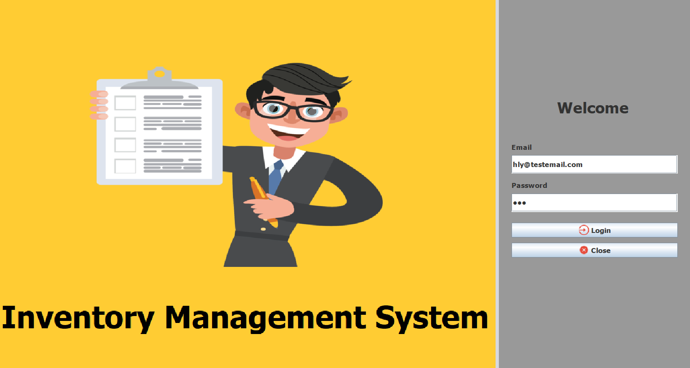
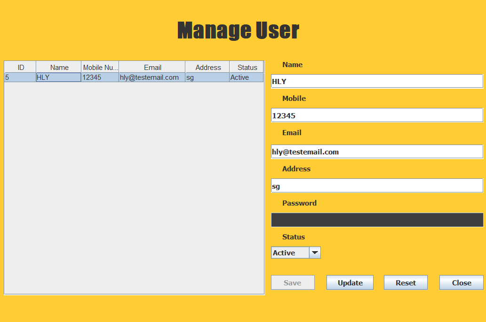
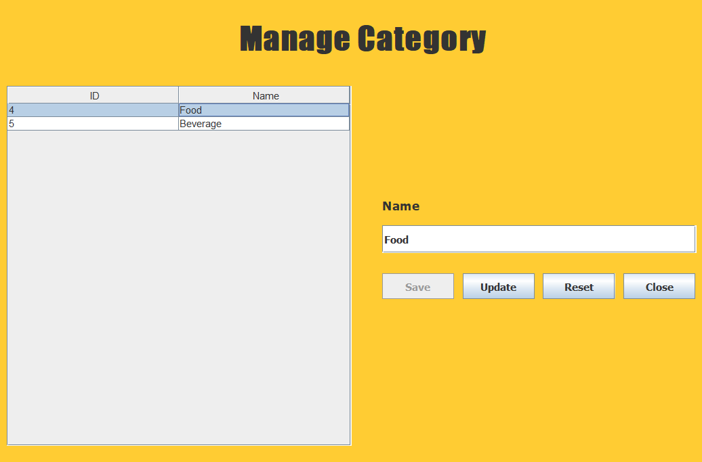
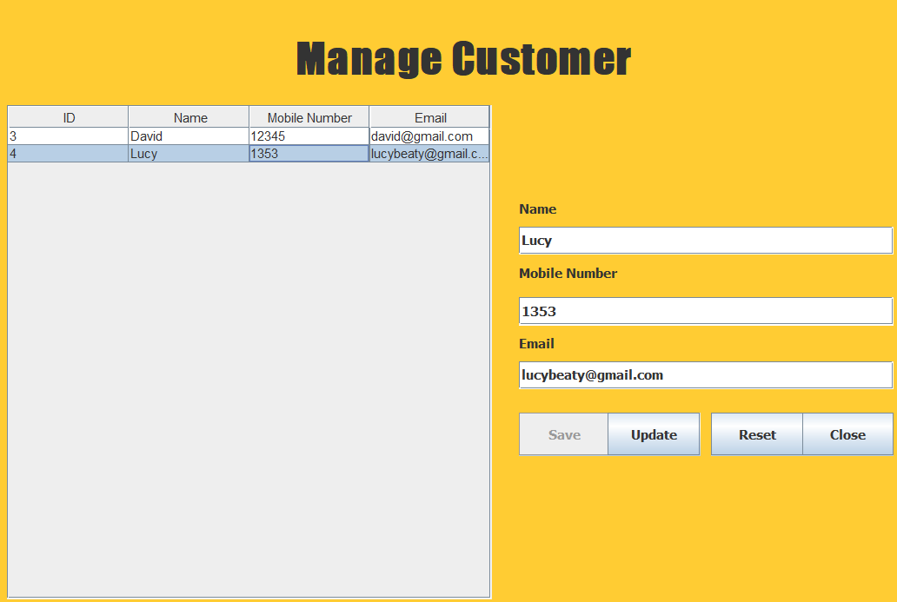
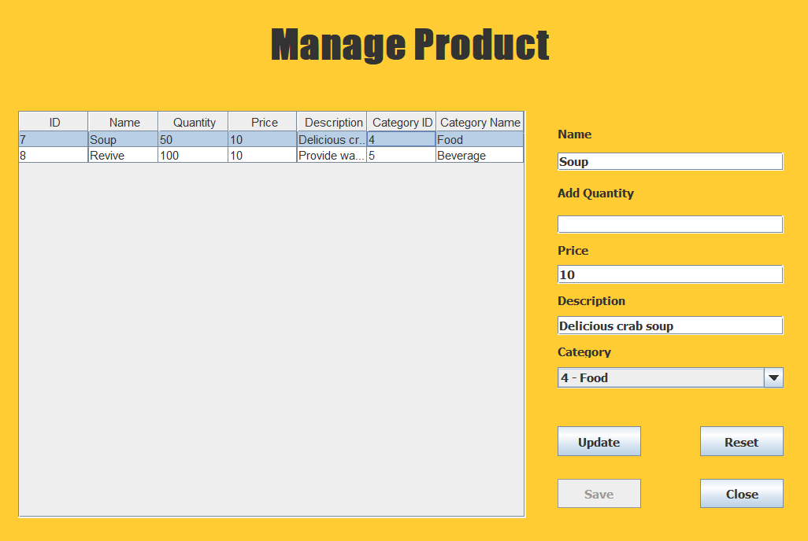
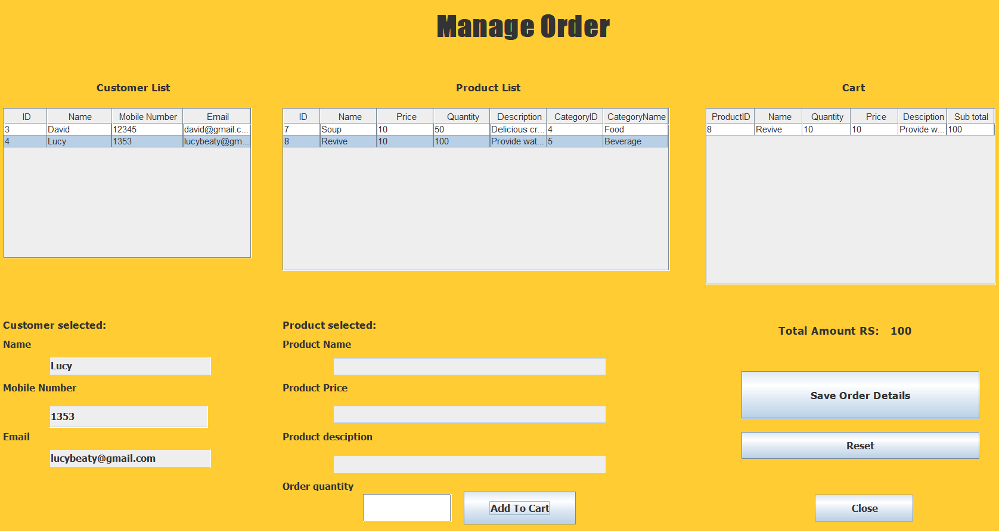
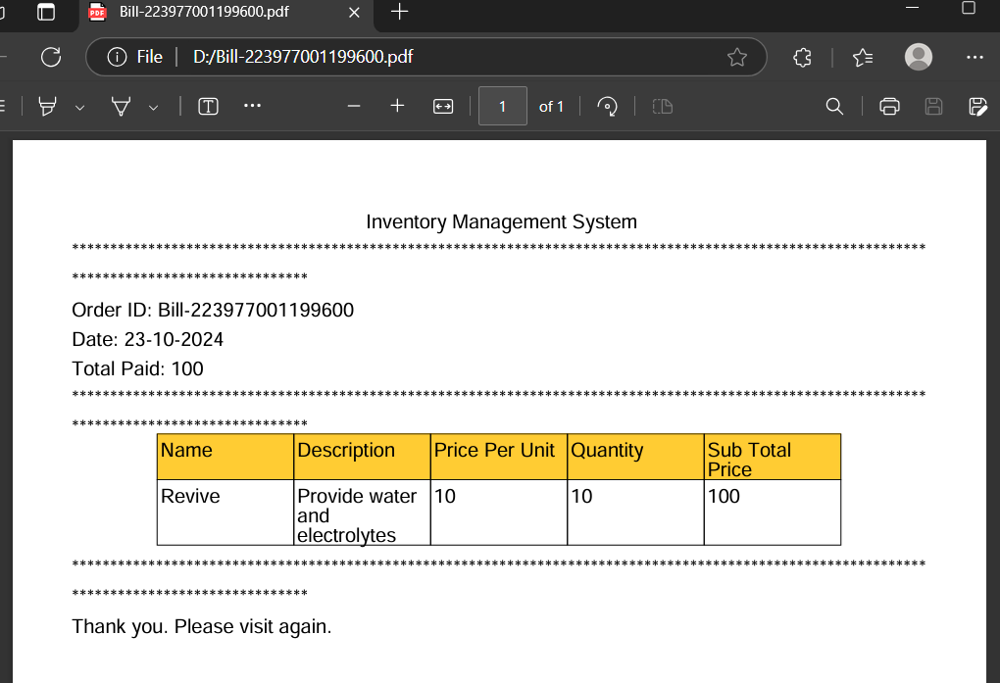
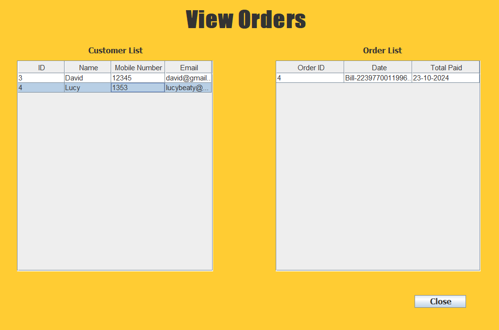

# Welcome to Inventory Management System Repository
### You will find in this repo the following stuff:
* JDBC connects to the mySql database
* Java Swing to create user interfaces
* Write logic processing functions
* Handling events
* ...

### Inventory Management application is a system that helps track, manage, and organize products, customers, invoices, and inventory-related transactions. This application can be applied to many fields such as retail, manufacturing, or online store management

## Login:

## User:

### Add and update user information. Change operating status

## Category: 

### Add product category 

## Customer: 

### Add and update customer information

## Product: 

### Add product 

## Category: 

### Add products, quantity, price, etc. 

## Order: 

### Order product

## Bill: 

### Print the bill in pdf file

## View order: 

### Review detailed order information

#### © 2024 ji-Ly
